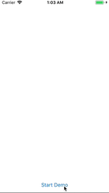

# CircularLayoutView

[](https://travis-ci.org/ahmedk92/CircularLayoutView)
[](http://cocoapods.org/pods/CircularLayoutView)
[](http://cocoapods.org/pods/CircularLayoutView)
[](http://cocoapods.org/pods/CircularLayoutView)

## Example

To run the example project, clone the repo, and run `pod install` from the Example directory first.



## Usage
Can be used from Iterface Builder and code.

### Interface Builder
1. Drag a `UIView` from the IB object library.
2. Set the class of the view to `CircularLayoutView`.
3. Adjust the `shift` and `radiusFactor`, if desired, from the attributes inspector.
4. Drag subviews into it.

### Code
```Swift
circularLayoutView.shift = -60 // 60 Degrees counter-clockwise.
circularLayoutView.radiusFactor = 0.5 // leave half of the available width as padding.
circularLayoutView.addSubview(aView)
```

## Requirements

## Installation

CircularLayoutView is available through [CocoaPods](http://cocoapods.org). To install
it, simply add the following line to your Podfile:

```ruby
pod 'CircularLayoutView'
```

## Author

ahmedk92, ahmedkhalaf.92@gmail.com

## License

CircularLayoutView is available under the MIT license. See the LICENSE file for more info.
=======
A container view to layout subviews in a circular fashion.

